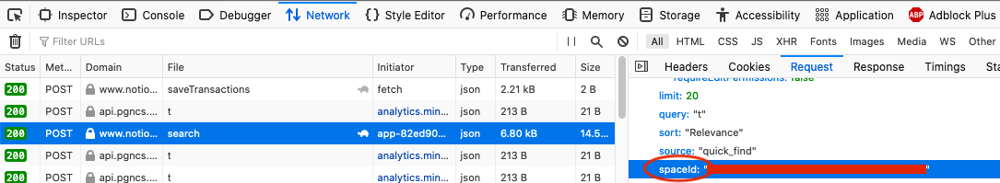

# notion-backup

### Warning: this repo is far from done, it's still work-in-progress!

TODO:

0. Create gifs for readme, update readme, document also how github actions work in this project
1. Gist: GoogleCredentials-Service Account, apache http client, okhttp
2. upload file to Nextcloud
3. create Dockerfile so ci-cd will pull it from dockerhub

### 1. Find Your notion-space-id

1. [Login](https://www.notion.so/login) to your notion profile
2. Open the network tab in your developer console
3. Click on "Quick Find" on the Notion menu (should be at the upper left corner) and type something
4. Typing will trigger a new request to `search`. Open that request and copy the value of `spaceId`

### 2. Google...

## Usage

First, we need to obtain our oauth credentials, here's how to do it:

### Generating Oauth Credentials

- Follow [Enable Drive API](#enable-drive-api) section.
- Open [google console](https://console.developers.google.com/).
- Click on "Credentials".
- Click "Create credentials" and select "Service Account".
- Give it a name and click "DONE" (You can ignore the other steps)
- Click on your newly created account in the displayed list.
- Keys -> Add Key -> Create new key -> JSON
- Download the secret file, rename it to `credentials.json` and move it to the project root directory.
- Login to your GDrive account and select the folder you want to share with your service account ***TODO***

Now, we have obtained our credentials, move to the [First run](#first-run) section to use those credentials:

### Enable Drive API

- Log into google developer console at [google console](https://console.developers.google.com/).
- Click select project at the right side of "Google Cloud Platform" of upper left of window.

If you cannot see the project, please try to access
to [https://console.cloud.google.com/cloud-resource-manager](https://console.cloud.google.com/cloud-resource-manager).

You can also create new project at there. When you create a new project there, please click the left of "Google Cloud Platform". You can see it like 3
horizontal lines.

By this, a side bar is opened. At there, select "API & Services" -> "Library". After this, follow the below steps:

- Click "NEW PROJECT" and input the "Project Name".
- Click "CREATE" and open the created project.
- Click "Enable APIs and get credentials like keys".
- Go to "Library"
- Input "Drive API" in "Search for APIs & Services".
- Click "Google Drive API" and click "ENABLE".

[Go back to oauth credentials setup](#generating-oauth-credentials)

#### Create a Service Account

Share your Drive account's folder to your service account. Your service account's addresss looks like XXX@XXX.iam.gserviceaccount.com. Then your service account
can see the shared folder from your Drive account.

TODO: If

a) GDRIVE_SERVICE_ACCOUNT_SECRET_VALUE: paste value here (as a secret in github for example)

b) GDRIVE_SERVICE_ACCOUNT_SECRET_FILE_PATH: File path for the secret file

### Dropbox

TODO: GIF

1. Create app on developer console
2. (Important to change the permissions first before generating a token)
   Go to permissions tab -> enable `files.content.write` & `files.content.read`
2. Generate token / copy secret as json file

> Long-lived tokens are less secure and will be deprecated in the future.

TODO: If/when the no-expiration-date tokens are removed then update the authentication method.

## Setup

### 3 ways

* Fork
* Docker?
* Locally?

### Fork

1. Create repository secrets for the following variables:

        # Required
        NOTION_SPACE_ID=1234-56789-abcdef
        NOTION_EMAIL=notion@example.com
        NOTION_PASSWORD=password
   
        # Optional
        GDRIVE_ROOT_FOLDER_ID=<get-the-folder-id-from-gdrive>
        GDRIVE_SERVICE_ACCOUNT=<get-the-service-account-info-from-1password>
        GDRIVE_SERVICE_ACCOUNT_SECRET_JSON=
        GDRIVE_SERVICE_ACCOUNT_SECRET_FILE_PATH=<file-path-to-json-credentials-file>
        
        DROPBOX_ACCESS_TOKEN=<generate-token-from-dropbox-developer-console>

2. Fork this repository. That's it!

## Running it locally

### Set Credentials

Create a `.env` file in the root directory of the project with the following properties:

    NOTION_SPACE_ID=1234-56789-abcdef
    NOTION_EMAIL=notion@example.com
    NOTION_PASSWORD=password
    GDRIVE_ROOT_FOLDER_ID=<get-the-folder-id-from-gdrive>
    GDRIVE_SERVICE_ACCOUNT=<get-the-service-account-info-from-1password>
    GDRIVE_SERVICE_ACCOUNT_SECRET_JSON=
    GDRIVE_SERVICE_ACCOUNT_SECRET_FILE_PATH=<file-path-to-json-credentials-file>
    DROPBOX_ACCESS_TOKEN=<generate-token-from-dropbox-developer-console>

### 4. Start the Export

Docker?

Run the application with ``

see also https://github.com/openownership/notion-backup
